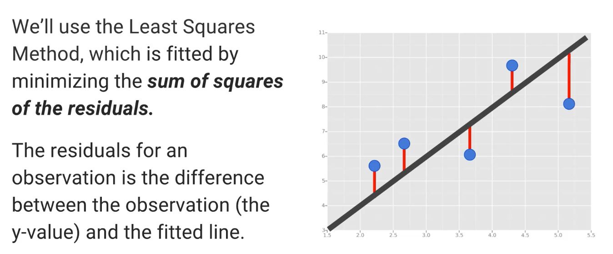

# machine-learning-python

These are my jupyter notebook notes for my self-study of Machine Learning in Python

<b>Linear Regression Notes:</b>
 - Line of best fit
 - Goal is to minimze the residuals
 - Two variables -> predict relationship 

  

 <b>Logistical Regression Notes:</b>
  - A type of Classification 
  	Examples (Binary Classification):
  		1. Spam vs Ham emails
  		2. Loan Default (yes/no)
  		3. Disease Diagnosis